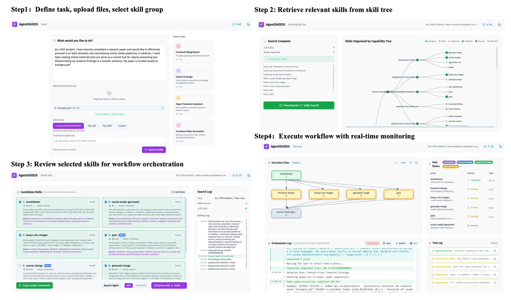

<p align="center">
  
</p>

<p align="center">
  English | <a href="README_zh.md">简体中文</a>
</p>

<h2 align="center">
  Build your agent from 90,000+ skills via skill <br><ins>RETRIEVAL</ins> & <ins>ORCHESTRATION</ins><br>
  <br style="line-height:0.1;">
  通过技能<ins>检索</ins>与<ins>编排</ins>，从 90,000+ 技能中构建Agent
</h2>


<p align="center">
  <a href="https://ynulihao.github.io/AgentSkillOS/"></a>
  <a href="https://www.python.org/downloads/"></a>
  <a href="https://opensource.org/licenses/MIT"></a>
  <a href="https://arxiv.org/abs/2603.02176"></a>
  <a href="assets/AgentSkillOS.pdf"></a>
</p>

> **News**
> - [2026/03] Paper is on [Arxiv](https://arxiv.org/abs/2603.02176)!
> - [2026/03] **Benchmark** coming soon — 30 multi-format creative tasks across 5 categories with pairwise Bradley-Terry evaluation.
> - [2026/03] **Modular Architecture** upgrade on the way — pluggable retrieval/orchestration modules and more.

## 🌐 Overview


<div align="center">

</div>

<p align="center" style="font-size: 1.1em;">
  🔥 <b>The agent skill ecosystem is exploding—over 90,000+</span>skills are now publicly available.</b>
</p>

<div align="center">

</div>

<p align="center">
  <i>
    But with so many options, how do you find the right skills for your task? And when one skill isn’t enough, how do you compose and orchestrate multiple skills into a working pipeline?<br>
    <br>
    <b>AgentSkillOS</b> is the operating system for agent skills—helping you <b>discover, compose, and run skill pipelines end-to-end</b>.
  </i>
</p>

<p align="center">
  <a href="https://www.youtube.com/watch?v=trh7doIZ3aA">
    
  </a>
</p>

<p align="center">
  
</p>


 ## 🌟 Highlights

- 🔍 **Skill Search & Discovery** — Creatively discover task-relevant skills with a skill tree that organizes skills into a hierarchy based on their capabilities.
- 🔗 **Skill Orchestration** — Compose and orchestrate multiple skills into a single workflow with a directed acyclic graph, automatically managing execution order, dependencies, and data flow across steps.
- 🖥️ **GUI (Human-in-the-Loop)** — A built-in GUI enables human intervention at every step, making workflows controllable, auditable, and easy to steer.
- ⭐ **High-Quality Skill Pool** — A curated collection of high-quality skills, selected based on Claude's implementation, GitHub stars, and download volume.
- 📊 **Observability & Debugging** — Trace each step with logs and metadata to debug faster and iterate on workflows with confidence.
- 🧩 **Extensible Skill Registry** — Easily plug in new skills, bring your own skills via a flexible registry.


## 💡 Examples

👉 [**View detailed workflows on Landing Page →**](https://ynulihao.github.io/AgentSkillOS/)

📊 [**Check out the comparison report: AgentSkillOS vs. without skills →**](comparison_en.md)

### Example 1: Cat Meme Video Generation

> **Task:**  I'm a short-video creator. Generate a cat meme video featuring a boss (Angry Cat) questioning an employee (Sad Cat) about work progress, with witty responses. Use `video.mp4` (green-screen footage) and `background.jpg`. Requirements: remove green-screen, maintain aspect ratio, add "Boss"/"Employee" labels, sync subtitles with meowing, and create humorous dialogue with viral potential.
> 
**Generated Video:**

<p align="center">
  <a href="https://www.youtube.com/watch?v=Km4l8ZuIacY">
    
  </a>
   &nbsp;&nbsp;&nbsp;&nbsp;
  <a href="https://www.youtube.com/watch?v=9g4OS79tzOo">
    
  </a>
</p>

<!-- **Video Case 1:**

<video src="https://github.com/user-attachments/assets/d4865e44-92cb-4f34-bce8-ee3eda014f6d.mp4" width="20%" controls></video>

**Video Case 2:**

<video src="https://github.com/user-attachments/assets/18360452-5d4f-4139-8733-7d28b85be257.mp4" width="20%" controls></video> -->

---
### Example 2: UI Design Research & Concept Generation

> **Task:**  I'm a product designer planning a knowledge management software. Research products like Notion and Confluence, then create a visual design style report (`report.docx`) with screenshots. Based on the analysis, generate three design concept images (`fusion_design_1/2/3.png`) that synthesize their design characteristics.

**Generated Design Concepts:**


**Generated Design Style Report:**


---

### Example 3: Front-End Bug Diagnosis & Report

> **Task:**  I'm a front-end developer. Users reported a bug when accessing my login page on mobile devices. Please identify and fix the bug, then generate a bug report with before/after screenshots highlighting the issue (For demonstration purposes, the bug screenshot is shown below).

<!-- **Original page with bug:** -->

<p align="center">
  
</p>

**Generated bug fix screenshots:**


**Generated Bug Report:**


---

### Example 4: Academic Paper Promotion

> **Task:**  As a PhD student, I've completed a research paper (`Avengers.pdf`) and want to promote it on social media platforms. Help me create promotional materials that effectively present my research findings to a broader audience.


**Generated Promotional Materials:**

*Xiaohongshu (RedNote) Post:*


*Other Social Media Content:*


*Scientific Slides:*


---

<!-- 
> Capability Tree organizes skills hierarchically → Complementarity-aware Retrieval selects diverse skill sets → Graph-based Orchestration executes them as DAG -->
## 🏗️ Architecture
- Skill tree construction: Organizes over 90,000+ skills into a capability tree, providing structured, coarse-to-fine access for efficient and creative skill discovery.
- Skill retrieval: Automatically selects a task-relevant subset of usable skills given a user’s request.
- Skill orchestration: Composes the selected skills into a coordinated plan (e.g., a DAG-based workflow) to solve tasks beyond the reach of any single skill. Note that we also support a freestyle mode (i.e., Claude Code).


### 🌲 Why Skill Tree?


> **Left**: Pure semantic retrieval prioritizes texutal similarity, often missing skills that look unrelated in embedding space but are crucial for actually solving the task—leading to narrow, myopic skill usage.
>
> **Right**: Our LLM + Skill Tree navigates the capability hierarchy to surface non-obvious but functionally relevant skills, enabling broader, more creative, and more effective skill composition.


## 🚀 How to Use

<details>
<summary><b>Installation & Configuration</b></summary>

### Prerequisites
- Python 3.10+
- [Claude Code](https://github.com/anthropics/claude-code) (must be installed and available in PATH)
- Use [cc-switch](https://github.com/farion1231/cc-switch) to switch to other LLM providers

### Install & Run
```bash
git clone https://github.com/ynulihao/AgentSkillOS.git
cd AgentSkillOS
pip install -e .
cp .env.example .env  # Edit with your API keys
python run.py --port 8765
```

### Download Pre-built Trees
| Tree | Skills | Description |
|------|--------|-------------|
| 🌱 `skill_seeds` | ~50 | Curated skill set (default) |
| 📦 `top500` | ~500 | Top 500 from skills.sh |
| 🗃️ `top1000` | ~1000 | Top 1000 from skills.sh |

- [Google Drive](https://drive.google.com/file/d/1IHbnrv9aSnsnMGYHzVTZJ8EtQl0dJfUL/view?usp=sharing) | [Baidu Pan (cei9)](https://pan.baidu.com/s/1Sg_a33PjLbYrBZj4hmsb-w?pwd=cei9)

### Configuration
```bash
# .env
LLM_MODEL=openai/anthropic/claude-opus-4.5
LLM_BASE_URL=https://openrouter.ai/api/v1
LLM_API_KEY=your-key

EMBEDDING_MODEL=openai/text-embedding-3-large
EMBEDDING_BASE_URL=https://api.openai.com/v1
EMBEDDING_API_KEY=your-key
```

### Custom Skill Groups
1. Create `data/my_skills/skill-name/SKILL.md`
2. Register in `src/config.py` → `SKILL_GROUPS`
3. Build: `python run.py build -g my_skills -v`

</details>

## 🔮 Future Work

- [ ] Interactive Agent Execution
- [ ] Plan Refinement
- [ ] Auto Skill Import
- [ ] Dependency Detection
- [ ] History Management
- [ ] Recipe Generation & Storage
- [ ] Multi-CLI Support (Codex, Gemini CLI, Cursor)


## Citation

If you find AgentSKillOS useful, consider citing our paper:
```bibtex
@article{li2026agentskillos,
  title={Leveraging, Managing, and Scaling the Agent Skill Ecosystem},
  author={Li, Hao and Mu, Chunjiang and Chen, Jianhao and Ren, Siyue and Cui, Zhiyao and Zhang, Yiqun and Bai, Lei and Hu, Shuyue},
  journal={arXiv preprint arXiv:2603.02176},
  year={2026}
}
```
