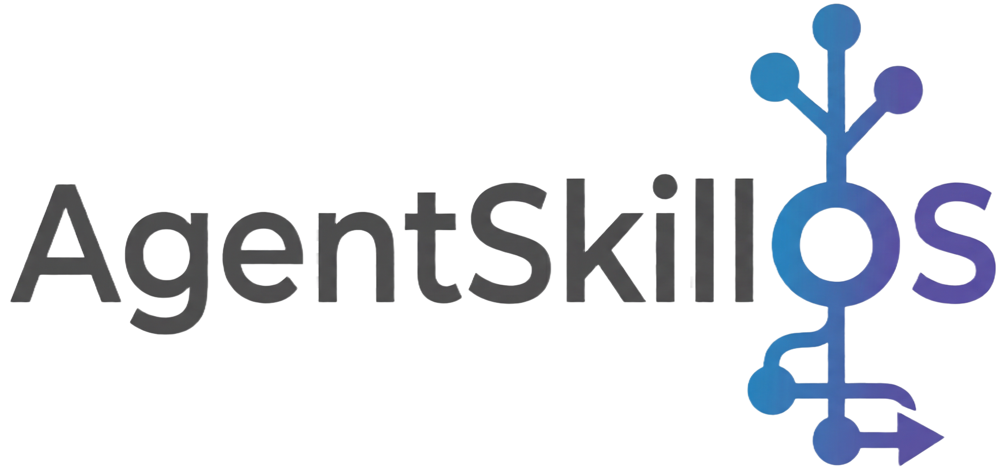
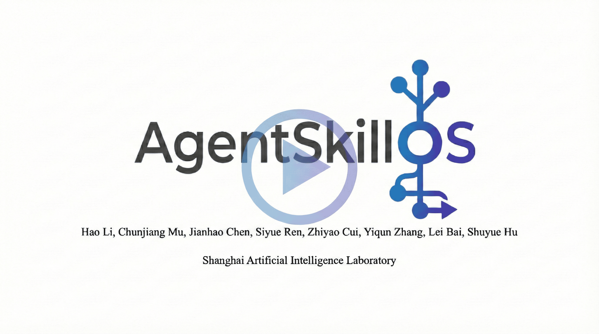
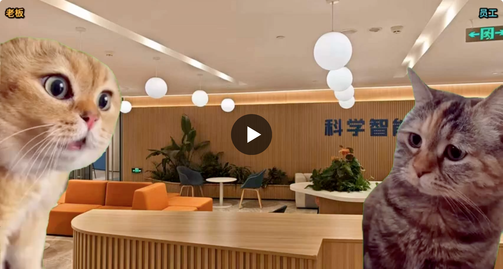
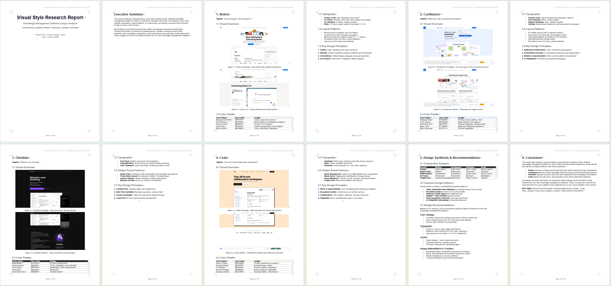
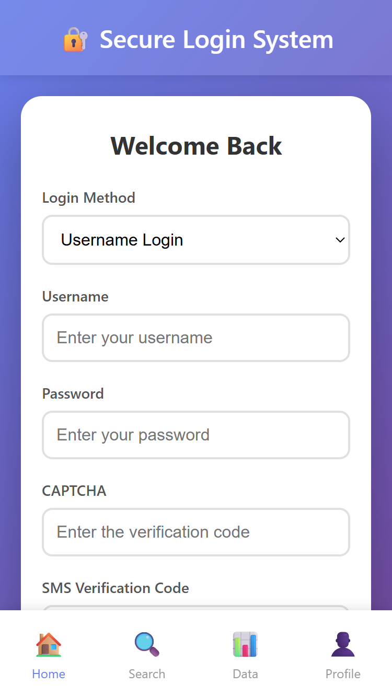
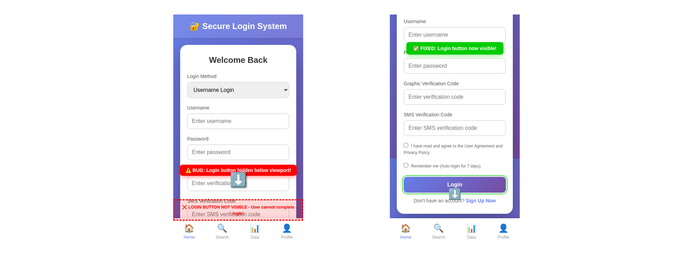
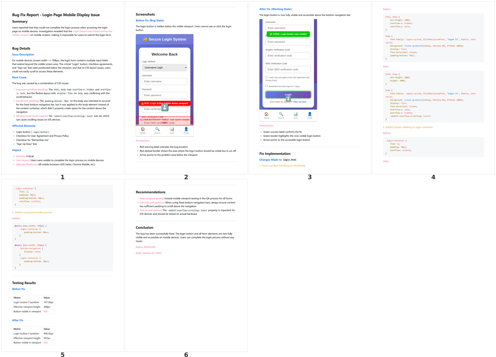
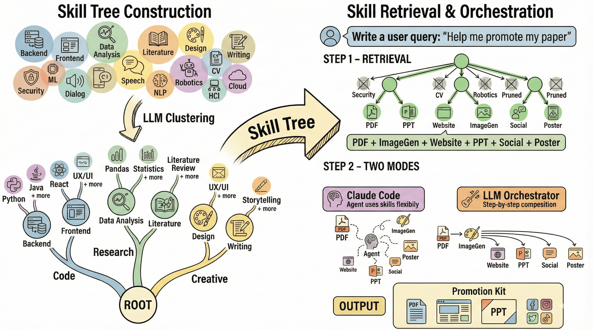

<p align="center">
  
</p>

<p align="center">
  <a href="README.md">English</a> | 简体中文
</p>

<h2 align="center">
  通过技能<ins>检索</ins>与<ins>编排</ins>，从 90,000+ 技能中构建Agent
</h2>


<p align="center">
  <a href="https://ynulihao.github.io/AgentSkillOS/"></a>
  <a href="https://www.python.org/downloads/"></a>
  <a href="https://opensource.org/licenses/MIT"></a>
  <a href="assets/AgentSkillOS.pdf"></a>
</p>

## 🌐 概述


<div align="center">

</div>

<p align="center" style="font-size: 1.1em;">
  🔥 <b>Agent技能生态正在爆发式增长——目前已有超过 90,000+ 技能公开可用。</b>
</p>

<div align="center">

</div>

<p align="center">
  <i>
    但面对如此众多的选择，你如何找到适合任务的技能？当单个技能不够用时，你又该如何组合和编排多个技能来构建完整的工作流？<br>
    <br>
    <b>AgentSkillOS</b> 是Agent技能的操作系统——帮助你<b>发现、组合和端到端运行技能流水线</b>。
  </i>
</p>

<p align="center">
  <a href="https://www.youtube.com/watch?v=trh7doIZ3aA">
    
  </a>
</p>

<p align="center">
  
</p>


 ## 🌟 核心亮点

- 🔍 **技能搜索与发现** — 通过技能树创造性地发现与任务相关的技能，技能树根据能力将技能组织成层次结构。
- 🔗 **技能编排** — 将多个技能组合编排成单一工作流，使用有向无环图自动管理执行顺序、依赖关系和跨步骤的数据流。
- 🖥️ **GUI（人机协作）** — 内置GUI支持在每个步骤进行人工干预，使工作流可控、可审计且易于引导。
- ⭐ **高质量技能池** — 精选的高质量技能集合，基于Claude的实现、GitHub星标数和下载量进行筛选。
- 📊 **可观测性与调试** — 通过日志和元数据追踪每个步骤，更快地调试并自信地迭代工作流。
- 🧩 **可扩展技能注册表** — 轻松插入新技能，通过灵活的注册表引入自定义技能。


## 💡 示例

👉 [**在落地页查看详细工作流 →**](https://ynulihao.github.io/AgentSkillOS/)

📊 [**查看对比报告：AgentSkillOS vs. 无技能 →**](comparison_zh.md)

### 示例 1: 猫咪表情包视频生成

> **任务：** 我是一名短视频创作者。生成一个猫咪表情包视频，展示老板（愤怒猫）质问员工（悲伤猫）工作进度，配上机智的回应。使用 `video.mp4`（绿幕素材）和 `background.jpg`。要求：去除绿幕、保持宽高比、添加"老板"/"员工"标签、字幕与猫叫声同步，并创作具有病毒传播潜力的幽默对话。
>
**生成的视频：**

<p align="center">
  <a href="https://www.youtube.com/watch?v=Km4l8ZuIacY">
    
  </a>
   &nbsp;&nbsp;&nbsp;&nbsp;
  <a href="https://www.youtube.com/watch?v=9g4OS79tzOo">
    
  </a>
</p>

<!-- **Video Case 1:**

<video src="https://github.com/user-attachments/assets/d4865e44-92cb-4f34-bce8-ee3eda014f6d.mp4" width="20%" controls></video>

**Video Case 2:**

<video src="https://github.com/user-attachments/assets/18360452-5d4f-4139-8733-7d28b85be257.mp4" width="20%" controls></video> -->

---
### 示例 2: UI设计研究与概念生成

> **任务：** 我是一名产品设计师，正在规划一款知识管理软件。研究Notion和Confluence等产品，然后创建一份包含截图的视觉设计风格报告（`report.docx`）。基于分析，生成三张融合其设计特点的设计概念图（`fusion_design_1/2/3.png`）。

**生成的设计概念：**


**生成的设计风格报告：**



---

### 示例 3: 前端Bug诊断与报告

> **任务：** 我是一名前端开发者。用户反馈在移动设备上访问我的登录页面时出现bug。请识别并修复该bug，然后生成一份包含修复前后截图的bug报告，突出显示问题所在（为演示目的，bug截图如下所示）。

<!-- **Original page with bug:** -->

<p align="center">
  
</p>

**生成的bug修复截图：**



**生成的Bug报告：**



---

### 示例 4: 学术论文推广

> **任务：** 作为一名博士生，我完成了一篇研究论文（`Avengers.pdf`），想在社交媒体平台上推广它。帮我创建推广材料，有效地向更广泛的受众展示我的研究成果。


**生成的推广材料：**

*小红书帖子：*


*其他社交媒体内容：*


*学术幻灯片：*


---

<!--
> Capability Tree organizes skills hierarchically → Complementarity-aware Retrieval selects diverse skill sets → Graph-based Orchestration executes them as DAG -->
## 🏗️ 架构
- 技能树构建：将超过 90,000+ 技能组织成能力树，提供结构化的粗到细访问，实现高效且创造性的技能发现。
- 技能检索：根据用户请求自动选择与任务相关的可用技能子集。
- 技能编排：将选定的技能组合成协调的计划（例如，基于DAG的工作流），以解决任何单个技能无法完成的任务。注意，我们也支持自由模式（即Claude Code）。


### 🌲 为什么使用技能树？


> **左图**：纯语义检索优先考虑文本相似性，经常遗漏那些在嵌入空间中看起来不相关但对实际解决任务至关重要的技能——导致技能使用狭窄、短视。
>
> **右图**：我们的LLM + 技能树导航能力层次结构，挖掘出非显而易见但功能相关的技能，实现更广泛、更具创造性和更有效的技能组合。


## 🚀 使用方法

<details>
<summary><b>安装与配置</b></summary>

### 前置条件
- Python 3.10+
- [Claude Code](https://github.com/anthropics/claude-code)（必须安装并添加到PATH）
- 使用 [cc-switch](https://github.com/farion1231/cc-switch) 切换到其他LLM提供商

### 安装与运行
```bash
git clone https://github.com/ynulihao/AgentSkillOS.git
cd AgentSkillOS
pip install -e .
cp .env.example .env  # 编辑并填入你的API密钥
python run.py --port 8765
```

### 下载预构建的技能树
| 技能树 | 技能数量 | 描述 |
|------|--------|-------------|
| 🌱 `skill_seeds` | ~50 | 精选技能集（默认） |
| 📦 `top500` | ~500 | skills.sh 前500 |
| 🗃️ `top1000` | ~1000 | skills.sh 前1000 |

- [Google Drive](https://drive.google.com/file/d/1IHbnrv9aSnsnMGYHzVTZJ8EtQl0dJfUL/view?usp=sharing) | [百度网盘 (cei9)](https://pan.baidu.com/s/1Sg_a33PjLbYrBZj4hmsb-w?pwd=cei9)

### 配置
```bash
# .env
LLM_MODEL=openai/anthropic/claude-opus-4.5
LLM_BASE_URL=https://openrouter.ai/api/v1
LLM_API_KEY=your-key

EMBEDDING_MODEL=openai/text-embedding-3-large
EMBEDDING_BASE_URL=https://api.openai.com/v1
EMBEDDING_API_KEY=your-key
```

### 自定义技能组
1. 创建 `data/my_skills/skill-name/SKILL.md`
2. 在 `src/config.py` → `SKILL_GROUPS` 中注册
3. 构建：`python run.py build -g my_skills -v`

</details>

## 🔮 未来计划

- [ ] 交互式Agent执行
- [ ] 计划优化
- [ ] 自动技能导入
- [ ] 依赖检测
- [ ] 历史管理
- [ ] 配方生成与存储
- [ ] 多CLI支持（Codex、Gemini CLI、Cursor）


## 引用

如果你觉得AgentSkillOS有用，请考虑引用我们的论文：
```bibtex
@article{li2026agentskillos,
  title={Leveraging, Managing, and Scaling the Agent Skill Ecosystem},
  author={Li, Hao and Mu, Chunjiang and Chen, Jianhao and Ren, Siyue and Cui, Zhiyao and Zhang, Yiqun and Bai, Lei and Hu, Shuyue},
  journal={Preprint},
  year={2026}
}
```
